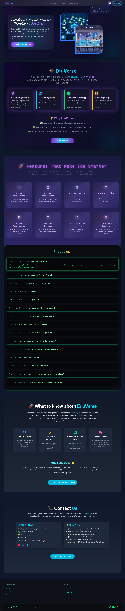
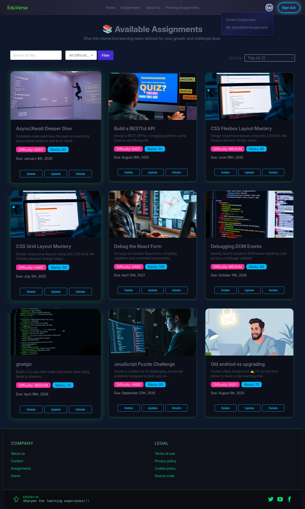
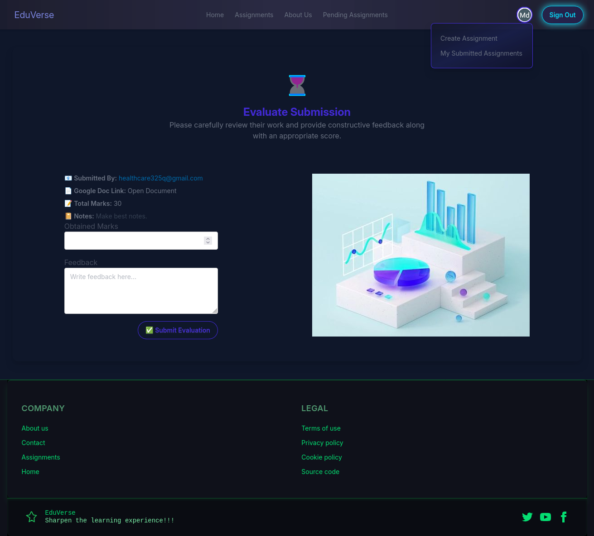

# 🚀 EduVerse — Online Group Study & Assignment Portal 🧑‍🏫👥

> EduVerse is a **MERN-based**, fully authenticated, and interactive assignment submission platform designed for students and groups. With a modern UI/UX, it enables seamless **collaboration**, **submission**, and **peer evaluation** of assignments.

---

## 🌐 Live Sites & Source Code

| Description              | Link                                                                       |
| ------------------------ | -------------------------------------------------------------------------- |
| 🔗 Live Client           | [https://edu-verse.surge.sh/](https://edu-verse.surge.sh/)                 |
| 🔗 Live Server           | [https://eduverse-server.vercel.app/](https://eduverse-server.vercel.app/) |
| 📦 Client Source Code    | [GitHub Repo](https://github.com/shahjalal-labs/eduverse-client)           |
| 📦 Server Source Code    | [GitHub Repo](https://github.com/shahjalal-labs/server-EduVerse-withjwt)   |
| 🌐 Portfolio Live        | [http://shahjalal-labs.surge.sh/](http://shahjalal-labs.surge.sh/)         |
| 📁 Portfolio Source Code | [GitHub Repo](https://github.com/shahjalal-labs/shahjalal-portfolio)       |

---

## 🎯 Project Purpose

EduVerse empowers students to:

- Create and assign group assignments
- Submit assignment links (e.g., Google Docs)
- Evaluate peer assignments (except your own)
- Track submission statuses, marks, and feedback
- Foster transparent academic collaboration

---

## ✨ Key Features

### 🔒 Authentication & Security

- Google & GitHub OAuth via Firebase Authentication
- JWT-based session management with HttpOnly cookies
- Route protection using `<ProtectedRoute />` component

### 📝 Assignment Management

- Create assignments with detailed info: title, description, difficulty, marks, and due date
- Edit and update existing assignments
- Submit assignments via Google Docs links and optional notes
- View submitted assignments along with marks and feedback

### 🧑‍🏫 Peer Evaluation

- Access ungraded submissions excluding own
- Provide marks and qualitative feedback

### 🧭 Routing & Navigation

- React Router v7 driven nested routes
- Public informational pages: About Us, Contact, Terms, Privacy, Cookies

---

## 🧱 Tech Stack

| Frontend        | Backend       | Styling & UI         | Utilities & Extras        |
| --------------- | ------------- | -------------------- | ------------------------- |
| React 19        | Node.js (Bun) | Tailwind CSS         | React Query               |
| Vite            | Express.js    | DaisyUI              | React Hook Form           |
| Firebase Auth   | MongoDB       | Motion (Framer)      | Lottie React Animations   |
| React Router v7 | JWT           | React Icons & Lucide | React Day Picker, DateFns |
|                 |               | SweetAlert2          | Axios, React Helmet Async |

---

## 🚀 Getting Started

### Prerequisites

- Node.js >= 18 (recommended)
- npm or yarn
- MongoDB (local or Atlas)
- Firebase project with Auth enabled

### Installation

```bash
# Clone the repository
git clone https://github.com/shahjalal-labs/eduverse-client.git
cd client-EduVerse-withjwt

# Install dependencies
npm install

# Start development server
npm run dev

```

#### 🗂️ Project Structure Overview

```
.
├── bun.lock
├── .env                     # Environment variables
├── eslint.config.js
├── index.html
├── package.json
├── public                   # Static files & CNAME for deployment
│   └── CNAME
├── README.md
├── src                      # Source code
│   ├── animation            # Lottie animations & motion utils
│   ├── assets               # Images, icons, previews
│   ├── contexts             # React context for Auth
│   ├── firebase             # Firebase initialization & utils
│   ├── hooks                # Custom React hooks
│   ├── modules              # Feature modules: assignments, auth, submissions, users
│   ├── pages                # Static & shared pages
│   ├── router               # Route definitions & protected routes
│   └── utils                # Helper functions & API utils
├── structure.md
└── vite.config.js

```

## 🧭 Detailed Routing Overview

| **Path**                  | **Description**                 | **Access** |
| ------------------------- | ------------------------------- | ---------- |
| `/`                       | Homepage                        | Public     |
| `/assignments`            | List all assignments            | Public     |
| `/assignments/create`     | Create a new assignment         | Protected  |
| `/assignments/pending`    | Pending submissions for review  | Protected  |
| `/assignment/details/:id` | View assignment details         | Protected  |
| `/assignment/submit/:id`  | Submit an assignment            | Protected  |
| `/assignment/my-submit`   | View your submitted assignments | Protected  |
| `/evaluate/:id`           | Evaluate a peer's submission    | Protected  |
| `/auth/signin`            | User sign-in page               | Public     |
| `/auth/signup`            | User sign-up page               | Public     |
| `/auth/forgot-pass`       | Password reset page             | Public     |
| `/about-us`               | About the platform              | Public     |
| `/contact-us`             | Contact information             | Public     |
| `/terms-condition`        | Terms & Conditions              | Public     |
| `/privacy-policy`         | Privacy Policy                  | Public     |
| `/cookie-policy`          | Cookie Policy                   | Public     |

---

## 🚀 Summary

- **Public routes** include homepage, assignments listing, auth pages, and informational pages.
- **Protected routes** require authentication for creating, submitting, evaluating, and managing assignments.
- Routing is implemented with React Router v7, ensuring smooth navigation and secure access control.

| **Route Path**            | **Component / Page**          | **Access** | **Description**                                                                                  |
| ------------------------- | ----------------------------- | ---------- | ------------------------------------------------------------------------------------------------ |
| `/`                       | Homepage (App.jsx)            | Public     | The landing page of the platform showcasing features and introduction.                           |
| `/assignments`            | Assignments.jsx               | Public     | Displays a list of all available assignments for all users.                                      |
| `/assignments/create`     | CreateAssignment.jsx          | Protected  | Form page to create a new assignment with details like title, description, due date, etc.        |
| `/assignments/pending`    | PendingAssignmentsPage.jsx    | Protected  | Shows submissions pending peer evaluation excluding user's own submissions.                      |
| `/assignment/details/:id` | AssignmentDetailsPage.jsx     | Protected  | Detailed view of a specific assignment including instructions and metadata.                      |
| `/assignment/submit/:id`  | SubmitAssignmentPage.jsx      | Protected  | Submission form for a particular assignment allowing users to submit links and notes.            |
| `/assignment/my-submit`   | MySubmittedAssignmentPage.jsx | Protected  | Displays all assignments submitted by the logged-in user along with marks and feedback received. |
| `/evaluate/:id`           | EvaluateSubmissionPage.jsx    | Protected  | Page where users can evaluate peer submissions by assigning marks and adding feedback.           |
| `/auth/signin`            | Signin.jsx                    | Public     | User sign-in page supporting Firebase OAuth and email/password login.                            |
| `/auth/signup`            | SignUp.jsx                    | Public     | Registration page for new users to create accounts.                                              |
| `/auth/forgot-pass`       | ForgotPass.jsx                | Public     | Password recovery page allowing users to reset their password via email.                         |
| `/about-us`               | AboutUs.jsx                   | Public     | Static informational page about the EduVerse platform and team.                                  |
| `/contact-us`             | ContactUs.jsx                 | Public     | Contact form and contact information for support or inquiries.                                   |
| `/terms-condition`        | TermsCondition.jsx            | Public     | Terms and conditions that govern the use of EduVerse platform.                                   |
| `/privacy-policy`         | PrivacyPolicy.jsx             | Public     | Details on how user data is collected, stored, and used.                                         |
| `/cookie-policy`          | CookiePolicy.jsx              | Public     | Information on cookies used by the platform and their purposes.                                  |

---

### Notes:

- **Protected routes** require user authentication and will redirect unauthenticated users to the `/auth/signin` page.
- Route parameters like `:id` refer to dynamic IDs corresponding to assignments or submissions.
- The routing logic is implemented with React Router v7 and enhanced with `ProtectedRoute.jsx` to enforce authentication guards.

```markdown
## 🚀 Available Scripts

| Command           | Description                 |
| ----------------- | --------------------------- |
| `npm run dev`     | Run development server      |
| `npm run build`   | Build production bundle     |
| `npm run lint`    | Run ESLint for code quality |
| `npm run preview` | Preview production build    |
```

## 🤝 Contributing

Contributions are warmly welcome! You can help improve this project by:

- 🐞 Reporting issues or bugs you encounter
- 💡 Suggesting new features or enhancements
- 🔄 Submitting pull requests with bug fixes or new functionality

### How to contribute:

1. **Fork** the repository to your own GitHub account
2. **Create a new branch** for your feature or bug fix (`git checkout -b feature/your-feature-name`)
3. **Make your changes** with clear, concise commit messages
4. **Test** your changes thoroughly before submitting
5. **Push** your branch to your forked repo
6. **Open a Pull Request** to the main repository with a detailed description of your changes

Please ensure your code follows existing styles and passes any linting or tests.

---

## 📝 License

This project is licensed under the **MIT License** © 2025 Md. Shahjalal.  
See the [LICENSE](LICENSE) file for full license details.

---

## 👨‍💻 Developer Info

| Detail           | Information                                                                                                       |
| ---------------- | ----------------------------------------------------------------------------------------------------------------- |
| 👤 **Name**      | Md. Shahjalal                                                                                                     |
| 📍 **Location**  | Sharifpur, Gazipur, Dhaka, Bangladesh                                                                             |
| 💼 **LinkedIn**  | [shahjalal-labs](https://www.linkedin.com/in/shahjalal-labs)                                                      |
| 📘 **Facebook**  | [Profile](https://www.facebook.com/profile.php?id=61556383702555)                                                 |
| ▶️ **YouTube**   | [@muhommodshahjalal9811](https://www.youtube.com/@shahjalal-labs)                                                 |
| 🧠 **GitHub**    | [shahjalal-labs](https://github.com/shahjalal-labs)                                                               |
| 🌐 **Portfolio** | [Live Site](http://shahjalal-labs.surge.sh/) • [Code Repo](https://github.com/shahjalal-labs/shahjalal-portfolio) |

## 🖼️ Project Preview

### Homepage



---

### Assignments List



---

### Create Assignment


---

### Pending Assignments for Evaluation


---

### Submit Assignment

_(Screenshot coming soon)_

---

### Evaluate Submission



---

### My Submitted Assignments


---

### 📱 Mobile View

#### Homepage


---

#### Assignments List


---

#### Create Assignment


---

#### Evaluate Submission


### 🔗 Live Interactive Demo

For the full interactive experience, real-time data, and latest features, please visit the live site:

👉 [https://edu-verse.surge.sh/](https://edu-verse.surge.sh/)

## ❓ FAQ

### Q: How do I reset my password if I forget it?

A: Use the "Forgot Password" link on the sign-in page to receive a password reset email.

### Q: Can I evaluate my own submissions?

B: No, the platform restricts peer evaluation to submissions from other users only.

### Q: What browsers are supported?

C: EduVerse supports all modern browsers including Chrome, Firefox, Edge, and Safari.

### Q: How do I contribute to the project?

D: Fork the repo, create a feature branch, make your changes, and submit a pull request. Please refer to the [Contributing](#🤝-contributing) section.

### Q: Who do I contact if I encounter a bug or issue?

E: Please open an issue on the GitHub repository or contact the developer via the support channels listed below.

---

## 📞 Contact & Support

For questions, bug reports, or feature requests, please use the following channels:

- **GitHub Issues:** [https://github.com/shahjalal-labs/eduverse-client/issues](https://github.com/shahjalal-labs/eduverse-client/issues)
- **Email:** shahjalal.support@example.com
- **Discord:** [EduVerse Community Discord](https://discord.gg/your-discord-invite)
- **Slack:** [EduVerse Workspace](https://your-slack-workspace-link)

Please include as much detail as possible when reporting issues to help us resolve them quickly.

## 🚀 Developer Info:


